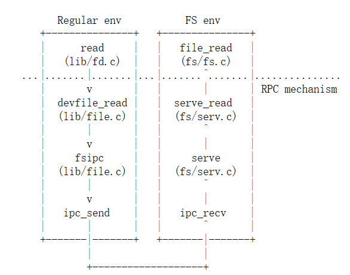

# lab5总结

这个lab是与文件系统相关的，但其实需要我们做的东西不多，我感觉我们也没有必要记很多细节。这个东西感觉对写应用层代码没啥帮助，对内核或者驱动相关的开发者我感觉也没啥用，除非你的工作就是与文件系统直接相关。所以我就列一下几个点吧。

## 过程总结
相当于我们对ide驱动代码做了封装，将对磁盘块的读写封装成了文件的读写。

此处要注意：这个lab的设计决定了JOS是微内核。即我们开了一个具有磁盘io访问权限的用户空间专门做文件系统服务器，其他进程要访问磁盘全都要与这个进程进行通信。

这个进程的磁盘io操作通过用户级缺页处理程序从磁盘进行文件读写，我们的工作也就从此开始。

然后是重新看时注意到或者说被问过的几个点：

### 文件元数据 的 数据结构
```c
struct File {
	char f_name[MAXNAMELEN];	// filename
	off_t f_size;			// file size in bytes
	uint32_t f_type;		// file type

	// Block pointers.
	// A block is allocated iff its value is != 0.
	uint32_t f_direct[NDIRECT];	// direct blocks
	uint32_t f_indirect;		// indirect block

	// Pad out to 256 bytes; must do arithmetic in case we're compiling
	// fsformat on a 64-bit machine.
	uint8_t f_pad[256 - MAXNAMELEN - 8 - 4*NDIRECT - 4];
} __attribute__((packed));	// required only on some 64-bit machines
```


### 文件系统接口


其实这个rpc也没什么难的， 就是层层调用+中间通信一下子。


**文件系统增删改查怎么搞？**
先介绍下项目中文件的数据结构。
怎么改的我底层不是很清楚。我只是借助磁盘ide驱动代码把操作磁盘块的操作给一层层往上封装了。
但是我的想法，如果在中间插入这种修改，比较高效的方式应该是先改变内容块的顺序，然后可能再在每一个块上做一些小操作。这样效率会高，不然你就像简单的数组中插入元素那种做法，感觉效率太低了。


这个lab总结好像我确实没写出来什么东西。。。。。。。。